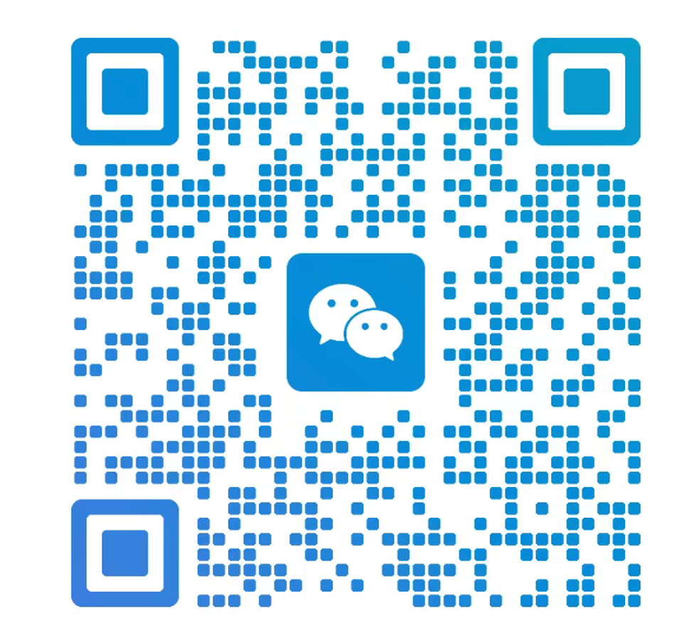

# 杰哥学习札记

个人技术知识的总结与沉淀，可直接在 GitHub 上阅读。

[开启在线阅读](https://coderliux.github.io/blog/)

**关于我：具备华为技术、平安科技、前海人寿、ThoughtWorks等企业的工作经历，专注企业架构、软件工程、数字化转型和AI应用。**

## 阅读建议

### 每个主题目录下是独立成篇的 Markdown 文档，目录页顶部可跳转对应章节。

- [x] 本体概念和建模样例（`ontology/ontology-concepts-and-modeling.md`）
- [ ] 更多主题持续补充中

## 许可证

本仓库内容以 [Creative Commons Attribution 4.0 International (CC BY 4.0)](https://creativecommons.org/licenses/by/4.0/) 授权使用。

## 联系
- 欢迎交流，扫一扫加我微信：

