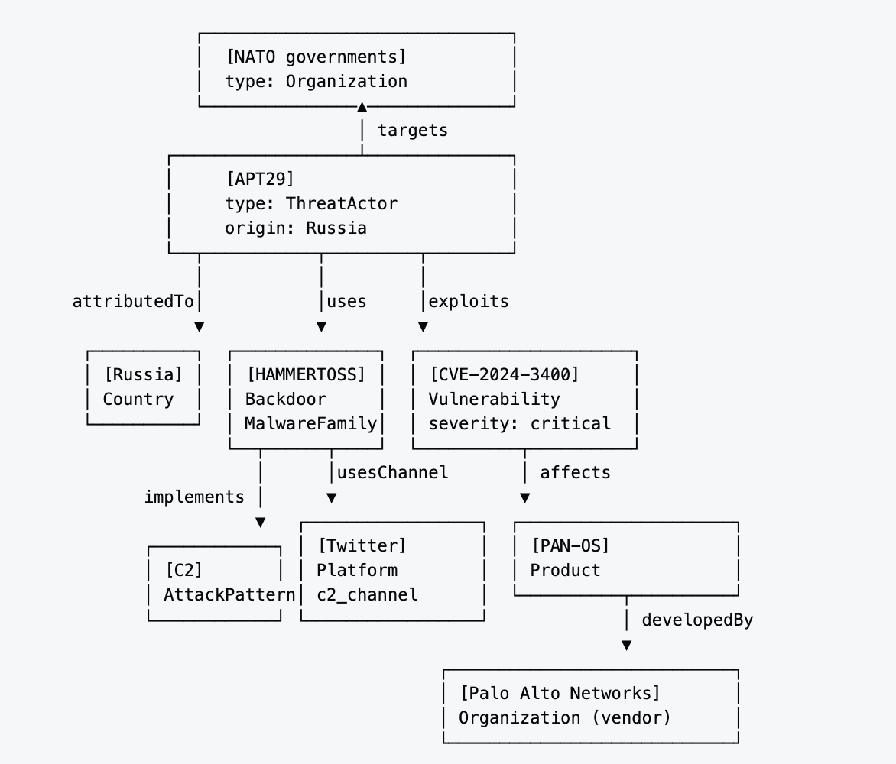

# 本体概念和建模样例

---

## 一、概念说明：本体 / 图谱 / 业务数据 / RAG

> 先对齐四个词，后面所有语法和示例都围绕这组关系展开。这四者不是并列关系，而是"**形 /  图 / 值 / 用**"四层分工。

### 1.1 本体（Ontology）

- **是什么**：对某个领域内**概念、概念间关系、属性、实例**的显式形式化规格说明——可理解为企业的"统一语言模型"。
- **四要素**：类（概念，如 ThreatActor/Vulnerability）、关系（如 exploits/affects）、属性（如 severity/cveId）、实例（如 APT29/CVE-2024-3400）。
- **一句话**：本体是知识图谱的 **Schema（骨架/图纸）**，管"形"。

### 1.2 图谱（知识图谱）

- **是什么**：本体（骨架）+ 实例（血肉），用"**实体-关系-实体**"三元组组织知识，支持多跳查询与推理。
- **举例**：`APT29 --exploits--> CVE-2024-3400 --affects--> PAN-OS` 这条链，就是图谱路径；"APT29 利用的漏洞影响的产品的厂商是谁"这类**跨实体多跳问题，只有图谱能答**。
- **一句话**：本体是图纸，知识图谱是"图纸 + 建成的大楼"；图谱管"关联与推理"。

### 1.3 业务数据

- **是什么**：企业系统里正在跑的事实与值——工单、缺陷、漏洞库记录、厂商资料等，是"数据权威"。
- **与图谱的关系**：业务数据管"值"（事实），图谱管"关系"（关联）。图谱是**瘦视图**——只把支撑关系查询/推理的实体、关系、关键属性放进去，明细留在业务库靠 `sourceKey` 回源，**不是全量同步**。

### 1.4 RAG（检索增强生成）

- **是什么**：让大模型**先检索企业私有知识，再基于检索结果生成答案**，解决"模型不知道私有知识 / 幻觉 / 无法更新"三大问题。
- **局限**：纯向量 RAG 抓不住"跨实体多跳关系"——这正是图谱补位的地方（GraphRAG 融合：向量管模糊召回、图谱管关系与多跳）。

### 1.5 四者的联系和区别

```
本体（Schema/图纸：概念/属性/关系/约束） ──骨架──► 知识图谱 = 本体骨架 + 实例血肉
业务数据（权威值：漏洞/厂商/情报记录）    ──物化实例──► 图谱实例
非结构化文档（威胁情报原文）             ──两阶段抽取──► 图谱实例（知识）
图谱 + 向量 ──融合──► RAG（先检索再生成，答案带引用可溯源）
```

| 维度 | 本体 | 图谱 | 业务数据 | RAG |
|------|------|------|----------|-----|
| 回答 | 有哪些概念/关系/约束 | 实体之间实际什么关系 | 事实的当前值是什么 | 怎么让模型答得准 |
| 层面 | Schema / 模式层 | Schema + 实例 | 数据源 / 权威库 | 应用层 / 检索生成 |
| 比喻 | 图纸 | 建成的大楼 | 建筑材料（砖瓦） | 装修队（按图纸+建材盖楼） |
| 典型能力 | OWL 推理、一致性 | 多跳查询、路径推理 | 增删改查、事务、回源 | 语义召回、生成、防幻觉 |
| 治理对象 | 概念与公理 | 实体与事实 | 数据质量 | 检索效果与引用 |

> 一句话：**本体管"形"、业务数据管"值"、图谱是两者的交汇、RAG 是最终让 AI 用起来的那一层。**

---

## 二、建模语言：OWL / RDF / SHACL / Turtle

### 2.1 四层关系总览

| 语言 | 回答的问题 | 层面 | 一句话 |
|------|-----------|------|--------|
| **OWL** | 领域语义怎么定义 | 本体层 | 定义领域里有哪些类、哪些属性、什么约束 |
| **RDF** | 数据怎么表示 | 数据层 | 以"图"的形式存三元组（主体 → 谓语 → 宾语） |
| **SHACL** | 数据怎么校验 | 校验层 | 针对具体类定义"形状"，规定它必须满足的约束 |
| **Turtle** | 怎么读写 | 语法层 | 人类可读的 RDF 图数据 / SHACL 形状的文件格式 |

**协作关系**（一个连续管道）：

```
Turtle 写出来 ──► OWL 本体（类/属性/约束）     ← 本体层：Schema
Turtle 写出来 ──► RDF 图数据（三元组）         ← 数据层：事实
Turtle 写出来 ──► SHACL 形状（验证规则）       ← 校验层：质量门禁
```

- **OWL 管"这张图里有什么规矩"**：哪些是类、类怎么分层、属性属于谁、属性有什么特征。
- **RDF 管"这张图画了什么"**：一个主语、一个谓语、一个宾语，组成一张无边无际的图。
- **SHACL 管"这张图合不合规"**：对特定类下校验规则，违规即输出报告（数据质量门禁）。
- **Turtle 管"这些东西用什么格式写出来"**：以上三者都能用 Turtle 表达，且人眼可读。

> 与属性图的区别：Neo4j 用"节点 + 关系 + 属性"；RDF 用"三元组"，且 IRI 全局唯一标识每个资源，天然适合跨系统、跨标准的语义互操作。

**命名空间前缀（namespace prefix）：`cti:` / `rdf:` / `owl:` 是什么意思**

RDF/Turtle 里 `@prefix 前缀: <完整IRI> .` 声明后，`前缀:名字` 就等价于 `完整IRI + 名字`——前缀是**缩写**，让长 IRI 短小可读（类似代码里 `import pandas as pd` 后写 `pd` 不写全名）。

| 前缀 | 完整 IRI | 是什么 | 常见用法 |
|------|---------|--------|---------|
| **`cti:`** | `https://cti.example.org/` | **领域自定义命名空间**（本文威胁情报） | `cti:APT29`、`cti:exploits`、`cti:ThreatActor` |
| **`rdf:`** | `http://www.w3.org/1999/02/22-rdf-syntax-ns#` | W3C 标准：RDF 基础词汇 | `rdf:type`（简写 `a`）——"某某是某类" |
| **`rdfs:`** | `http://www.w3.org/2000/01/rdf-schema#` | W3C 标准：RDF Schema 词汇 | `rdfs:subClassOf`、`rdfs:domain`、`rdfs:range` |
| **`owl:`** | `http://www.w3.org/2002/07/owl#` | W3C 标准：OWL 本体词汇 | `owl:Class`、`owl:ObjectProperty`、`owl:inverseOf` |
| **`xsd:`** | `http://www.w3.org/2001/XMLSchema#` | W3C 标准：XML 数据类型 | `xsd:decimal`、`xsd:string`、`xsd:dateTime` |
| **`sh:`** | `http://www.w3.org/ns/shacl#` | W3C 标准：SHACL 校验词汇 | `sh:NodeShape`、`sh:targetClass`、`sh:minCount` |

**关键区别**：`rdf:` / `rdfs:` / `owl:` / `xsd:` / `sh:` 是 **W3C 标准词汇**——全世界的本体引用同一套 IRI，机器才能互通，你永远不该自己定义 `owl:Class` 的含义；`cti:` 是**你的领域自定义命名空间**——`ThreatActor`、`exploits` 是你为领域造的类/属性，挂在自选域名下。

展开看（§2.3 的三条事实）：

```turtle
cti:APT29 rdf:type     cti:ThreatActor .
cti:APT29 cti:exploits cti:CVE-2024-3400 .
```

等价于完整 IRI 写法：

```turtle
<https://cti.example.org/APT29> <http://www.w3.org/1999/02/22-rdf-syntax-ns#type>
    <https://cti.example.org/ThreatActor> .
```

> 为什么必须前缀：IRI 是 RDF 全局唯一标识资源的方式（类似主键），但整串写出来又长又难读——前缀就是给长 IRI 起的别名。

### 2.2 OWL —— Web 本体语言（本体层）

**定义**：OWL（Web Ontology Language）：一种用于**构建本体**的语言。它定义了领域中存在的**类**（Class）和**属性**（Property），并可用逻辑公理表达"什么东西必须、可能与什么有关"。

**类（Class）：有哪些概念**

```turtle
cti:Malware        rdf:type  owl:Class .                   # 概念：恶意软件
cti:Backdoor       rdf:type  owl:Class ;
                   rdfs:subClassOf  cti:Malware .          # 概念层级：后门 是 恶意软件 的子类
cti:Vulnerability  rdf:type  owl:Class .
cti:Product        rdf:type  owl:Class ;
                   owl:disjointWith  cti:Vulnerability .   # 不相交：产品不可能是漏洞
```

- **`subClassOf`** 建立 is-a 层级；**`equivalentClass`** 表达类语义等价（跨本体对齐）；**`disjointWith`** 表达类互斥。

**属性（Property）：有什么关系**

对象属性（个体 ↔ 个体）：

```turtle
cti:exploits  rdf:type  owl:ObjectProperty ;
             rdfs:domain  cti:ThreatActor ;     # 主体的类型约束
             rdfs:range   cti:Vulnerability ;  # 客体的类型约束
             owl:inverseOf  cti:exploitedBy .  # 逆属性：A exploits B ⟺ B exploitedBy A
```

数据属性（个体 ↔ 字面量）：

```turtle
cti:confidence  rdf:type  owl:DatatypeProperty ;
               rdfs:domain  cti:ExtractedFact ;     # 只挂在"抽取事实"上
               rdfs:range   xsd:decimal .          # 值必须是小数
```

**属性特征公理**（RBox）：

| 公理 | 含义 | 例子 |
|------|------|------|
| `owl:TransitiveProperty` | 传递：A→B→C 则 A→C | `partOf` |
| `owl:SymmetricProperty` | 对称：A↔B 则 B↔A | `interactsWith` |
| `owl:FunctionalProperty` | 函数性：最多一个值 | 一个事实的 `confidence` 只有一个值 |
| `owl:InverseFunctionalProperty` | 逆函数：值能唯一反推主体 | 工号唯一对应员工 |

**约束（Restrictions）**：OWL 用"匿名限制类"表达业务规则——某类的成员**必须满足**这些条件：

```turtle
# 规则：任何 Vulnerability 至少影响一个产品（affects 最小基数 1）
cti:Vulnerability  rdf:type  owl:Class ;
    rdfs:subClassOf  [
        rdf:type          owl:Restriction ;
        owl:onProperty    cti:affects ;
        owl:minCardinality  1
    ] .
```

- **量词**：`owl:someValuesFrom` / `owl:allValuesFrom`；
- **基数**：`owl:minCardinality` / `owl:maxCardinality` / `owl:cardinality`；
- **取值**：`owl:hasValue`。

**TBox / ABox：术语盒与断言盒（OWL 的两层结构）**：

描述逻辑（OWL 的语义基础）把本体拆成两个盒子，这是理解"本体 vs 图谱"的底层框架：

| 盒子 | 全称 | 存什么 | 类比 |
|------|------|--------|------|
| **TBox** | Terminological Box（术语盒） | **模式层**：类、属性、约束、公理（是"哪些概念、什么关系、什么规矩"） | 图纸 / Schema |
| **ABox** | Assertional Box（断言盒） | **实例层**：具体个体 + 事实断言（是"谁、和谁、有什么关系"） | 大楼里的血肉 / 数据 |

对应到 OWL/RDF 文件里：
**TBox 就是类与属性声明（`a owl:Class` / `a owl:ObjectProperty` + `subClassOf` + 约束），ABox 就是个体与断言（`cti:APT29 a cti:ThreatActor` + `cti:APT29 cti:exploits cti:CVE-2024-3400`）**。

用第三章 CTI 样例对照（详见 §3.7）：

```turtle
# —— TBox：定义模式（哪些概念、什么关系、什么约束）——
cti:ThreatActor   a owl:Class .                          # 概念：威胁行为体
cti:Vulnerability a owl:Class .                          # 概念：漏洞
cti:exploits      a owl:ObjectProperty ;                 # 关系：利用
    rdfs:domain cti:ThreatActor ;
    rdfs:range  cti:Vulnerability .
cti:Vulnerability a owl:Class ;
    rdfs:subClassOf [ a owl:Restriction ;
        owl:onProperty cti:affects ; owl:minCardinality 1 ] .   # 约束：漏洞必须影响产品

# —— ABox：填实例（谁、和谁、什么关系）——
cti:APT29         a cti:ThreatActor .                    # 个体：APT29 是威胁行为体
cti:CVE-2024-3400 a cti:Vulnerability .                  # 个体：CVE-2024-3400 是漏洞
cti:APT29         cti:exploits cti:CVE-2024-3400 .       # 断言：APT29 利用 CVE-2024-3400
```

**工程意义（为什么分开）**：
- **TBox 演进不动 ABox**：新增一个类/关系只改 TBox，已有实例事实（ABox）无需重写——Schema 版本演进与数据解耦。
- **先冻结 TBox 再灌 ABox**：本体经专家评审冻结（G3 门禁）后，才允许抽取填实例，避免"边建边抽"导致 Schema 漂移。
- **校验分层**：SHACL 针对 ABox 里的个体做形状校验（数据层门禁）；OWL 针对 TBox 做一致性检查（模式层正确性）。
- 本文第六章 6.3"落地要点"第 1 条"TBox / ABox 分离"即此意。

### 2.3 RDF —— 资源描述框架（数据层）

**定义**：RDF（Resource Description Framework）：一种以**图形式**表示数据的标准方式。它将信息视为连接的**三元组**：

```
Subject（主体）→ Predicate（谓语）→ Object（客体）
```

- 主体与客体都是图中的**节点**，谓语是**有向边**；每个三元组就是一个"事实"；资源用 **IRI** 全局唯一标识，客体也可以是**字面量**。

**具体示例（Turtle 语法）**：

```turtle
@prefix rdf:  <http://www.w3.org/1999/02/22-rdf-syntax-ns#> .
@prefix cti:  <https://cti.example.org/> .

# 三条事实（三元组）
cti:APT29           rdf:type           cti:ThreatActor .      # 事实1：类型
cti:APT29           cti:exploits       cti:CVE-2024-3400 .    # 事实2：利用
cti:CVE-2024-3400   cti:affects        cti:PAN-OS .           # 事实3：影响
```

对应的图（一条边 = 一个三元组）：

```
APT29 ──exploits──► CVE-2024-3400 ──affects──► PAN-OS
   └──rdf:type──► ThreatActor
```

**RDF vs 属性图（选型视角）**：

| 维度 | RDF 三元组 | 属性图（Neo4j 等） |
|------|-----------|---------------------|
| 结构 | 三元组，边也是资源（可被引用） | 节点 + 关系，关系不可单独引用 |
| 标识 | IRI 全局唯一，天然支持跨系统融合 | 节点 ID 通常库内唯一 |
| 语义标准 | 与 OWL/SHACL/SPARQL 组成 W3C 标准栈 | 图内自带 Schema，标准化弱 |
| 推理 | 支持 OWL 推理 | 无标准推理，靠 Cypher 逻辑 |
| 适合 | 跨系统语义互操作、本体治理、严格校验 | 业务图谱、快速开发、路径分析 |

### 2.4 SHACL —— 形状约束语言（校验层）

**定义**：SHACL（Shapes Constraint Language）：**实际的验证规则**。"形状"（Shape）针对数据中的**特定类**，定义它**必须遵循的约束**。

- 与 OWL 的本质区别：**OWL 是逻辑公理（告诉推理机"能推出什么"），SHACL 是形状约束（告诉校验器"必须长什么样"）**。
- 校验结果输出**验证报告**：哪条形状、哪个节点、违反了哪个约束、具体值是什么——可直接对接数据质量门禁。

**具体示例**：

```turtle
@prefix sh:  <http://www.w3.org/ns/shacl#> .
@prefix cti: <https://cti.example.org/> .

# 形状：针对 Vulnerability 类
cti:VulnerabilityShape  rdf:type  sh:NodeShape ;
    sh:targetClass  cti:Vulnerability ;        # 校验谁：所有 Vulnerability 实例

    # 规则1：必须有 cveId，且格式必须匹配
    sh:property  [
        sh:path     cti:cveId ;
        sh:minCount 1 ;                          # 至少 1 个
        sh:maxCount 1 ;                          # 恰好 1 个
        sh:pattern  "^CVE-\\d{4}-\\d+$"         # 值必须是合法 CVE 编号
    ] ;

    # 规则2：必须有 affects（漏洞不能没有影响面）
    sh:property  [
        sh:path     cti:affects ;
        sh:minCount 1
    ] ;

    # 规则3：置信度必须是 [0,1] 的小数
    sh:property  [
        sh:path         cti:confidence ;
        sh:datatype     xsd:decimal ;
        sh:minInclusive 0 ;
        sh:maxInclusive 1
    ] .
```

**SHACL vs OWL**：

| 维度 | OWL | SHACL |
|------|-----|-------|
| 定位 | 语义定义 + 逻辑推理 | 数据形状校验 |
| 输出 | 推理出的新事实 / 一致性 | 验证报告（谁违规、违反什么） |
| 典型场景 | 定义语义、驱动 NL→SPARQL | 入库前质量门禁、抽取结果抽检 |

### 2.5 Turtle —— 序列化格式（语法层）

**定义**：Turtle（`.ttl`）：一种**流行的、人类可读的 RDF 图数据和 SHACL 形状文件格式**。它是 W3C 标准，是所有示例的载体。

**为什么用 Turtle**：
- **紧凑可读**：用 `@prefix` 缩短 IRI，用分号/逗号/方括号压缩重复主语或谓语。
- **标准互通**：与 RDF/XML、JSON-LD、N-Triples 等价，可无损互转。
- **一个格式搞定**：Protégé 导出、Oxigraph 导入等都以 Turtle 为主。

**语法速记（同一份数据的三种写法）**：

```turtle
@prefix cti: <https://cti.example.org/> .

# ① 完整写法：每条独立
cti:APT29 cti:exploits cti:CVE-2024-3400 .
cti:APT29 cti:uses     cti:HAMMERTOSS .

# ② 分号压缩：同一主语，多谓语
cti:APT29 cti:exploits cti:CVE-2024-3400 ;
          cti:uses     cti:HAMMERTOSS .

# ③ 方括号匿名节点：客体可再展开
cti:APT29 cti:exploits [ cti:confidence 0.97 ] .
```

**其他序列化格式**：

| 格式 | 特点 | 用在哪 |
|------|------|--------|
| Turtle (.ttl) | 紧凑、人类可读 | 本体与形状文件的默认选择 |
| JSON-LD | JSON 生态、前后端友好 | Web API、JS 应用 |
| RDF/XML | 最早的标准、冗长 | 兼容老工具（如部分 Protégé 导出） |
| N-Triples (.nt) | 一行一个三元组、最朴素 | 流式大数据处理 |

---

## 三、CTI 威胁情报领域建模示例

> 用一套五条威胁情报事实，完整走一遍"输入 → 实体/关系/属性 → JSON → Cypher → 正式语义建模（OWL/RDF/SHACL/Turtle）→ 图谱"的建模链路。

### 3.1 输入：五条原始情报事实

原始英文文本（使用LLM建模）：

> "APT29 is a Russian state-sponsored threat actor targeting NATO governments."（APT29 是俄罗斯背景威胁组织，目标北约政府）
> 
> "CVE-2024-3400 is a critical vulnerability in PAN-OS exploited by APT29."（CVE-2024-3400 是 PAN-OS 关键漏洞，被 APT29 利用）
> 
> "CVE-2024-3401 is a minor vulnerability in PAN-OS exploited by APT29."（CVE-2024-3401 是 PAN-OS 低危漏洞，被 APT29 利用）
> 
> "HAMMERTOSS is a backdoor malware family used by APT29 for C2 over Twitter."（HAMMERTOSS 是 APT29 用于经 Twitter C2 的后门家族）
> 
> "PAN-OS is a network operating system developed by Palo Alto Networks."（PAN-OS 是 Palo Alto Networks 开发的网络操作系统）

### 3.2 实体层（Entity Layer）

| 实体 | 实体类型 | 关键属性 |
|------|---------|----------|
| APT29 | ThreatActor（威胁行为体） | `origin=Russia`、`sponsorship=state-sponsored` |
| Russia | Country（国家） | 归因目标 |
| NATO governments | Organization（政府/组织） | `role=victim` |
| CVE-2024-3400 | Vulnerability（漏洞） | `severity=critical` |
| CVE-2024-3401 | Vulnerability（漏洞） | `severity=minor` |
| PAN-OS | Product（产品） | `kind=network operating system` |
| HAMMERTOSS | Malware（恶意软件） | `category=backdoor` |
| Twitter | Platform（平台） | `role=c2_channel` |
| Palo Alto Networks | Organization（组织） | `role=vendor` |

### 3.3 关系层（Relationship Layer）

| 源实体 | 关系类型 | 目标实体 | 说明 |
|--------|---------|----------|------|
| APT29 | `targets` | NATO governments | 攻击目标，1..N |
| APT29 | `attributedTo` | Russia | 归因 |
| APT29 | `exploits` | CVE-2024-3400 | 高危漏洞 |
| APT29 | `exploits` | CVE-2024-3401 | 低危漏洞 |
| CVE-2024-3400 | `affects` | PAN-OS | — |
| CVE-2024-3401 | `affects` | PAN-OS | — |
| APT29 | `uses` | HAMMERTOSS | 恶意工具家族 |
| HAMMERTOSS | `usesChannel` | Twitter | `channel=c2` |
| Palo Alto Networks | `develops` | PAN-OS | 与 3.7 的 `developedBy` 互为逆 |

**结构示意**：

```
APT29 --targets--> NATO governments
APT29 --attributedTo--> Russia
APT29 --exploits--> CVE-2024-3400 --affects--> PAN-OS
APT29 --exploits--> CVE-2024-3401 --affects--> PAN-OS
APT29 --uses--> HAMMERTOSS --usesChannel--> Twitter
Palo Alto Networks --develops--> PAN-OS
```

### 3.4 属性层（Attribute Layer）

| 属性 | 挂载对象 | 类型 | 说明 |
|------|---------|------|------|
| `origin` | APT29 | 数据属性 | 来源国家 |
| `sponsorship` | APT29 | 数据属性 | 国家资助 |
| `role` | NATO / Twitter / Palo Alto | 数据属性 | victim / c2_channel / vendor |
| `severity` | CVE-2024-3400/3401 | 数据属性 | critical / minor（OWL 里进一步具体化为 `SeverityLevel` 个体） |
| `kind` | PAN-OS | 数据属性 | network operating system |
| `category` | HAMMERTOSS | 数据属性 | backdoor |
| `cveId` | Vulnerability | 数据属性 | CVE 编号（SHACL 校验格式） |
| `sourceDoc` / `confidence` | ExtractedFact | 数据属性 | 溯源：来源文档 + 置信度 |

**本体模式（Schema）归纳**：
- **实体类型**：`ThreatActor`、`Country`、`Organization`、`Vulnerability`、`Product`、`Malware`、`Platform`
- **关系类型**：`targets`、`attributedTo`、`exploits`、`uses`、`affects`、`develops`（⟷ `developedBy`）、`usesChannel`

### 3.5 JSON 表示（graph.json）

```json
{
  "entities": [
    { "id": "APT29",              "type": "ThreatActor",  "properties": { "origin": "Russia", "sponsorship": "state-sponsored" } },
    { "id": "Russia",             "type": "Country",      "properties": {} },
    { "id": "NATO governments",   "type": "Organization", "properties": { "role": "victim" } },
    { "id": "CVE-2024-3400",      "type": "Vulnerability","properties": { "cveId": "CVE-2024-3400", "severity": "critical" } },
    { "id": "CVE-2024-3401",      "type": "Vulnerability","properties": { "cveId": "CVE-2024-3401", "severity": "minor" } },
    { "id": "PAN-OS",             "type": "Product",      "properties": { "kind": "network operating system" } },
    { "id": "HAMMERTOSS",         "type": "Malware",      "properties": { "category": "backdoor" } },
    { "id": "Twitter",            "type": "Platform",     "properties": { "role": "c2_channel" } },
    { "id": "Palo Alto Networks", "type": "Organization", "properties": { "role": "vendor" } }
  ],
  "relations": [
    { "source": "APT29",              "type": "targets",           "target": "NATO governments" },
    { "source": "APT29",              "type": "attributedTo",      "target": "Russia" },
    { "source": "APT29",              "type": "exploits",          "target": "CVE-2024-3400" },
    { "source": "CVE-2024-3400",      "type": "affects",           "target": "PAN-OS" },
    { "source": "APT29",              "type": "exploits",          "target": "CVE-2024-3401" },
    { "source": "CVE-2024-3401",      "type": "affects",           "target": "PAN-OS" },
    { "source": "APT29",              "type": "uses",              "target": "HAMMERTOSS" },
    { "source": "HAMMERTOSS",         "type": "usesChannel",       "target": "Twitter",       "properties": { "channel": "c2" } },
    { "source": "Palo Alto Networks", "type": "develops",          "target": "PAN-OS" }
  ]
}
```

### 3.6 Cypher 表示（Neo4j 属性图导入）

```cypher
CREATE (a:ThreatActor   {name:'APT29', origin:'Russia', sponsorship:'state-sponsored'})
CREATE (r:Country       {name:'Russia'})
CREATE (n:Organization  {name:'NATO governments', role:'victim'})
CREATE (v1:Vulnerability {cveId:'CVE-2024-3400', severity:'critical'})
CREATE (v2:Vulnerability {cveId:'CVE-2024-3401', severity:'minor'})
CREATE (p:Product       {name:'PAN-OS', kind:'network operating system'})
CREATE (m:Malware       {name:'HAMMERTOSS', category:'backdoor'})
CREATE (t:Platform      {name:'Twitter', role:'c2_channel'})
CREATE (pa:Organization {name:'Palo Alto Networks', role:'vendor'})
CREATE (a)-[:TARGETS]->(n)
CREATE (a)-[:ATTRIBUTED_TO]->(r)
CREATE (a)-[:EXPLOITS]->(v1)-[:AFFECTS]->(p)
CREATE (a)-[:EXPLOITS]->(v2)-[:AFFECTS]->(p)
CREATE (a)-[:USES]->(m)-[:USES_CHANNEL {channel:'c2'}]->(t)
CREATE (pa)-[:DEVELOPS]->(p);
```

### 3.7 正式语义建模：OWL / RDF / SHACL / Turtle

输入的五条事实与主要三元组的对应关系：

| 陈述 | 主要三元组 |
|------|-----------|
| APT29 是俄罗斯背景威胁组织，目标 NATO 政府 | `APT29 attributedTo Russia`；`APT29 targets NATO` |
| CVE-2024-3400 是 PAN-OS 关键漏洞，被 APT29 利用 | `CVE-2024-3400 hasSeverity Critical`；`affects PAN-OS`；`exploitedBy APT29` |
| CVE-2024-3401 是 PAN-OS 低危漏洞，被 APT29 利用 | `CVE-2024-3401 hasSeverity Minor`；`affects PAN-OS`；`exploitedBy APT29` |
| HAMMERTOSS 是 APT29 用于经 Twitter C2 的后门家族 | `HAMMERTOSS a Backdoor`；`usedBy APT29`；`implements C2`；`usesChannel Twitter` |
| PAN-OS 是 Palo Alto 开发的网络操作系统 | `PAN-OS a Product`；`developedBy PaloAltoNetworks` |

```turtle
@prefix rdf:  <http://www.w3.org/1999/02/22-rdf-syntax-ns#> .
@prefix rdfs: <http://www.w3.org/2000/01/rdf-schema#> .
@prefix owl:  <http://www.w3.org/2002/07/owl#> .
@prefix xsd:  <http://www.w3.org/2001/XMLSchema#> .
@prefix sh:   <http://www.w3.org/ns/shacl#> .
@prefix cti:  <https://cti.example.org/> .

########################
# 第1层：OWL 本体（Schema）
########################

# 类与层级
cti:ThreatActor    a owl:Class .
cti:Malware        a owl:Class .
cti:Backdoor       a owl:Class ; rdfs:subClassOf cti:Malware .
cti:MalwareFamily  a owl:Class ; rdfs:subClassOf cti:Malware .
cti:Vulnerability  a owl:Class .
cti:Product        a owl:Class .
cti:Organization   a owl:Class .
cti:Country        a owl:Class ; rdfs:subClassOf cti:Organization .
cti:AttackPattern  a owl:Class .
cti:Platform       a owl:Class .
cti:SeverityLevel  a owl:Class .
cti:ExtractedFact  a owl:Class .      # 抽取事实包装（溯源用）

# 对象属性（实体间关系）
cti:targets      a owl:ObjectProperty ; rdfs:domain cti:ThreatActor ; rdfs:range cti:Organization .
cti:attributedTo a owl:ObjectProperty ; rdfs:domain cti:ThreatActor ; rdfs:range cti:Country .
cti:exploits     a owl:ObjectProperty ; rdfs:domain cti:ThreatActor ; rdfs:range cti:Vulnerability .
cti:exploitedBy  a owl:ObjectProperty ; owl:inverseOf cti:exploits .
cti:uses         a owl:ObjectProperty ; rdfs:domain cti:ThreatActor ; rdfs:range cti:Malware .
cti:usedBy       a owl:ObjectProperty ; owl:inverseOf cti:uses .
cti:affects      a owl:ObjectProperty ; rdfs:domain cti:Vulnerability ; rdfs:range cti:Product .
cti:affectedBy   a owl:ObjectProperty ; owl:inverseOf cti:affects .
cti:developedBy  a owl:ObjectProperty ; rdfs:domain cti:Product ; rdfs:range cti:Organization .
cti:hasSeverity  a owl:ObjectProperty ; rdfs:domain cti:Vulnerability ; rdfs:range cti:SeverityLevel .
cti:implements   a owl:ObjectProperty ; rdfs:domain cti:Malware ; rdfs:range cti:AttackPattern .
cti:usesChannel  a owl:ObjectProperty ; rdfs:domain cti:Malware ; rdfs:range cti:Platform .

# 数据属性（数值）
cti:cveId       a owl:DatatypeProperty ; rdfs:domain cti:Vulnerability ; rdfs:range xsd:string .
cti:confidence  a owl:DatatypeProperty ; rdfs:domain cti:ExtractedFact ; rdfs:range xsd:decimal .
cti:sourceDoc   a owl:DatatypeProperty ; rdfs:domain cti:ExtractedFact ; rdfs:range xsd:string .

########################
# 第2层：RDF 实例（ABox）
########################

# 组织与地缘
cti:Russia  a cti:Country ; rdfs:label "Russia" .
cti:NATO    a cti:Organization ; rdfs:label "NATO" .
cti:PaloAltoNetworks  a cti:Organization ; rdfs:label "Palo Alto Networks" .

# 威胁组织
cti:APT29  a cti:ThreatActor ; rdfs:label "APT29" ;
    cti:attributedTo cti:Russia ;
    cti:targets      cti:NATO ;
    cti:uses         cti:HAMMERTOSS ;
    cti:exploits     cti:CVE-2024-3400 , cti:CVE-2024-3401 .

# 漏洞
cti:CVE-2024-3400  a cti:Vulnerability ;
    cti:cveId       "CVE-2024-3400" ;
    cti:affects     cti:PAN-OS ;
    cti:hasSeverity cti:Critical .
cti:CVE-2024-3401  a cti:Vulnerability ;
    cti:cveId       "CVE-2024-3401" ;
    cti:affects     cti:PAN-OS ;
    cti:hasSeverity cti:Minor .

cti:Critical  a cti:SeverityLevel ; rdfs:label "critical" .
cti:Minor     a cti:SeverityLevel ; rdfs:label "minor" .

# 产品
cti:PAN-OS  a cti:Product ; rdfs:label "PAN-OS" ;
    cti:developedBy cti:PaloAltoNetworks .

# 恶意软件与战术
cti:HAMMERTOSS  a cti:Backdoor , cti:MalwareFamily ; rdfs:label "HAMMERTOSS" ;
    cti:implements  cti:C2 ;
    cti:usesChannel cti:Twitter .
cti:C2       a cti:AttackPattern ; rdfs:label "Command-and-Control" .
cti:Twitter  a cti:Platform ; rdfs:label "Twitter" .

# 溯源（PROV-O 口径）
cti:fact-1  a cti:ExtractedFact ;
    cti:sourceDoc  "reports/apt29-report-2026.pdf" ;
    cti:confidence 0.97 .

########################
# 第3层：SHACL 形状（质量门禁）
########################

cti:VulnerabilityShape  a sh:NodeShape ;
    sh:targetClass cti:Vulnerability ;
    sh:property [ sh:path cti:cveId ; sh:minCount 1 ; sh:maxCount 1 ;
                  sh:pattern "^CVE-\\d{4}-\\d+$" ] ;
    sh:property [ sh:path cti:affects ; sh:minCount 1 ; sh:class cti:Product ] ;
    sh:property [ sh:path cti:hasSeverity ; sh:minCount 1 ; sh:maxCount 1 ;
                  sh:class cti:SeverityLevel ] .

cti:ThreatActorShape  a sh:NodeShape ;
    sh:targetClass cti:ThreatActor ;
    sh:property [ sh:path cti:attributedTo ; sh:minCount 1 ; sh:class cti:Country ] ;
    sh:property [ sh:path cti:uses ; sh:minCount 1 ; sh:class cti:Malware ] ;
    sh:property [ sh:path cti:exploits ; sh:minCount 1 ; sh:class cti:Vulnerability ] .

cti:MalwareShape  a sh:NodeShape ;
    sh:targetClass cti:Malware ;
    sh:property [ sh:path cti:implements ; sh:minCount 1 ; sh:class cti:AttackPattern ] .

cti:ProductShape  a sh:NodeShape ;
    sh:targetClass cti:Product ;
    sh:property [ sh:path cti:developedBy ; sh:minCount 1 ; sh:class cti:Organization ] .

########################
# 校验结论（假设）
########################
# 五条数据全部通过：CVE 两条有合法 cveId + affects PAN-OS + 各一个 severity；
#   APT29 有归因国家、用恶意软件、利用漏洞；PAN-OS 有厂商；HAMMERTOSS 实现了 C2。
# 关键推理联动：
#   ① Backdoor ⊑ Malware、MalwareFamily ⊑ Malware → 推理机推出 HAMMERTOSS a Malware，
#      从而满足 ThreatActorShape 里 uses sh:class Malware——先跑推理再跑 SHACL，模型与校验不打架。
#   ② owl:inverseOf 让 exploits ⟷ exploitedBy 自动补全（APT29 exploits CVE ⟹ CVE exploitedBy APT29）。
#   ③ 同 STIX 2.1 对齐：类对应 threat-actor / vulnerability / malware / tool /
#      attack-pattern / identity 对象，cveId / severity / sourceDoc 字段一一对应，便于互通。
```

### 3.8 图谱：本体填实例 = 图谱

上面 3.2~3.6 从直觉模型画图、3.7 落成 OWL/RDF/SHACL 正式建模。把两者合一——**用本体（Schema）约束 + 实例（ABox）填充**，这张知识图谱就是"建成的大楼"：



（`CVE-2024-3401` 与 `CVE-2024-3400` 同构：`APT29 --exploits--> CVE-2024-3401 --affects--> PAN-OS`，省略避免重叠。）

**这张图说明了什么**：

- **本体 = 图纸**：`ThreatActor / Vulnerability / Product / Malware / Organization / Platform / Country / AttackPattern` 这些类、`exploits / affects / uses / usesChannel / developedBy / attributedTo / targets` 这些属性，全部来自 3.7 的 OWL 定义——图里的**每个节点带 `type:` 类标签、每条边就是对象属性**，没有超纲。

- **实例 = 血肉**：`APT29 / CVE-2024-3400 / PAN-OS…` 这些具体实体来自 3.7 的 RDF ABox——图里每个方框就是一个个体。

- **SHACL = 门禁**：图能进库，是因为通过了 3.7 的 `VulnerabilityShape / ThreatActorShape / ProductShape` 校验（有 cveId、有 severity、有厂商、有归因……）。

- **一句话**：这张图 = OWL（Schema）＋ RDF 实例（ABox）＋ SHACL 校验 三者拼出来的**知识图谱**；与 3.6 的 Cypher 属性图是同一知识的两种表示（属性图侧重导入 Neo4j，这里侧重"本体约束下的成品图"）。

---

## 四、存储：示例数据如何落库

> 例子按"三层存储"分别落地，核心分工：**关系库管事实、图库管关系、向量库管召回**，图谱是"瘦视图"靠 `sourceKey` 回源明细。

### 4.1 三类数据库对比

| 维度 | 关系数据库（PostgreSQL/MySQL） | 图数据库（Neo4j/Oxigraph/RDF） | 向量数据库（Milvus/pgvector） |
|------|-------------------------------|-------------------------------|-------------------------------|
| 数据模型 | 表 + 行 + 外键 | 节点 + 关系（或 RDF 三元组） | 向量 + 元数据 |
| 擅长 | 事务、明细、报表、回源 | 多跳关系查询、路径推理 | 语义相似度召回 |
| 不擅长 | 深链多跳查询（多层 JOIN 很慢） | 事务密集、明细报表 | 精确关系、事务 |
| 在本例的角色 | 权威事实源（漏洞/厂商/情报明细） | 关系发现与推理 | 语义检索入口 |
| 存储形态 | 见 4.2 | 见 4.3 | 见 4.4 |

### 4.2 关系数据库存储（权威事实源）

APT29 情报在关系库的建表与插入：

```sql
-- 实体表（瘦列，明细可加）
CREATE TABLE threat_actor (
    id            TEXT PRIMARY KEY,
    name          TEXT NOT NULL,
    origin        TEXT,
    sponsorship   TEXT
);
CREATE TABLE vulnerability (
    id         TEXT PRIMARY KEY,   -- 'CVE-2024-3400'
    severity   TEXT,
    product_id TEXT REFERENCES product(id)
);
CREATE TABLE product (
    id   TEXT PRIMARY KEY,         -- 'PAN-OS'
    name TEXT,
    vendor_id TEXT REFERENCES organization(id)
);
CREATE TABLE organization (
    id   TEXT PRIMARY KEY,
    name TEXT,
    role TEXT
);

-- 关系表（多对多）
CREATE TABLE exploitation (
    actor_id  TEXT REFERENCES threat_actor(id),
    vuln_id   TEXT REFERENCES vulnerability(id),
    PRIMARY KEY (actor_id, vuln_id)
);

INSERT INTO threat_actor VALUES ('apt29', 'APT29', 'Russia', 'state-sponsored');
INSERT INTO product    VALUES ('panos', 'PAN-OS', 'paloalto');
INSERT INTO organization VALUES ('paloalto', 'Palo Alto Networks', 'vendor');
INSERT INTO vulnerability VALUES ('CVE-2024-3400', 'critical', 'panos');
INSERT INTO exploitation VALUES ('apt29', 'CVE-2024-3400');
```

> 角色：**业务库唯一权威**，图谱节点/边都带 `sourceKey` 回指这里的行（如 `vulnerability.id='CVE-2024-3400'`），关键数字读路径回源校验。

### 4.3 图数据库存储（关系发现）

用 3.6 的 Cypher 导入 Neo4j（节点 9 个、关系 9 条），或把 3.7 的 Turtle 导入 RDF 存储（Oxigraph/Jena）。查询示例：

```cypher
// 多跳："APT29 利用的漏洞影响的产品是谁开发的？"
MATCH (a:ThreatActor {name:'APT29'})-[:EXPLOITS]->(v:Vulnerability)-[:AFFECTS]->(p:Product)-[:DEVELOPS]->
      (o:Organization)
RETURN a.name, v.id, p.name, o.name
```

```sparql
# 等价 SPARQL（RDF 存储）
PREFIX cti: <https://cti.example.org/>
SELECT ?vuln ?prod ?org WHERE {
  ?actor cti:exploits ?vuln ; cti:targets ?org .
  ?vuln  cti:affects  ?prod .
}
```

> 角色：**图谱当"关系发现器"不当"数据仓库"**——只存支撑关系查询/推理的实体、关系、关键属性，明细靠 `sourceKey` 回业务库。

### 4.4 向量数据库存储（语义召回入口）

把实体与事实向量化，作为检索入口（再走图谱多跳展开）：

```python
# 伪代码：实体/文档块 → embedding → Milvus
from pymilvus import Collection
col = Collection("cti_entities")
col.insert([
    {"id": "apt29",      "vector": embed("APT29 Russian state-sponsored threat actor"),
     "entity_type": "ThreatActor", "source_key": "apt29"},
    {"id": "cve3400",    "vector": embed("CVE-2024-3400 critical vulnerability in PAN-OS"),
     "entity_type": "Vulnerability", "source_key": "CVE-2024-3400"},
])
```

> 角色：**向量库管"入口召回"、图谱管"关系展开"、业务库管"明细确认"**——三路各司其职。问"APT29 相关情报"先用向量命中候选实体，再沿图谱多跳拿链路。

### 4.5 存储策略与选型

- **一致性靠"单向流"**：业务库唯一权威 → 事件/CDC 触发图谱 upsert（幂等）→ 节点/边带 `version + updated_at` 与 `sourceKey`，旧三元组标"过期"而非物理删 → 定时对账 + 读路径回源校验（有界最终一致，不搞 ACID 双写）。
- **规模参考**：CTI/研发类图谱一般**百万~千万实体、几百万~千万边**，单机图库足够；真到亿级再上分布式图库（NebulaGraph/TigerGraph）。

---

## 五、本体与知识图谱的应用场景

> 前面讲完概念（一）、语言（二）、示例（三）、存储（四），这一章回答"**用在哪、解决什么问题**"。先给 2 个典型应用场景，再承接第六章的工程化 SOP。

### 5.1 场景一：威胁情报关联分析（以本文 CTI 为例）

**业务问题**：威胁情报散落在报告、漏洞库、厂商公告里，分析师要回答跨实体多跳问题——"APT29 用的恶意软件经什么平台回连？""它利用的漏洞影响的产品的厂商是谁？"纯文档检索（关键词/向量）答不了这种**关系型问题**。

**本体+图谱解法**：

```
威胁情报原文 ──两阶段抽取──► 三元组（APT29 exploits CVE-2024-3400）
     │                          │
     ▼                          ▼
本体（ThreatActor/Vulnerability/Product…） ──约束──► 知识图谱（节点 + 边）
     │                                                    │
     ▼                                                    ▼
SHACL 门禁（cveId 格式、归因必填）              沿边多跳查询 + GraphRAG 回答
```

**落地形态**（对齐第一~四章）：
- **本体**：第三章 CTI 样例（8 类 + 7 关系 + SHACL 约束），管"威胁情报的语言统一"——不同来源（报告/漏洞库/厂商）的同一实体（如 `CVE-2024-3400`）靠 `cveId` 对齐。
- **图谱**：实体与关系实例化，支撑 `MATCH ...-[:EXPLOITS]->()-[:AFFECTS]->()-[:DEVELOPS]->() RETURN` 这类多跳查询（§4.3 有 Cypher/SPARQL 示例）。
- **RAG 增强**：GraphRAG 融合——向量召回候选实体 + 图谱沿边扩散给证据链，答案带 `sourceDoc` 可溯源（§1.4）。

**业务价值**：把"分析师翻 N 份报告拼线索"变成"一个查询拿全攻击链"，缩短威胁狩猎时间、可审计可溯源。

**示例：一次威胁情报问答的端到端演示**

分析师问："APT29 利用的漏洞影响的产品，是谁开发的？"

```text
用户提问（自然语言）
   │  NL→SPARQL / Text2Cypher 转换
   ▼
图谱查询：MATCH (a:ThreatActor {name:'APT29'})-[:EXPLOITS]->(v:Vulnerability)
                   -[:AFFECTS]->(p:Product)-[:DEVELOPS]->(o:Organization)
          RETURN v.id, p.name, o.name
   │
   ▼
图谱命中路径（§3.8 图里的一条链）：
   APT29 --exploits--> CVE-2024-3400 --affects--> PAN-OS --developedBy--> Palo Alto Networks
   │
   ▼
LLM 生成答案（带引用，可溯源）：
   "APT29 利用的 CVE-2024-3400（PAN-OS 关键漏洞）影响 PAN-OS，由 Palo Alto Networks 开发。
    [证据] CVE-2024-3400 affects PAN-OS；PAN-OS developedBy Palo Alto Networks。
    [溯源] reports/apt29-report-2026.pdf → 第 3 节"
```

**这 5 行演示了场景一的完整闭环**：自然语言 → 图谱多跳查询 → 路径命中 → 带引用的答案。回答"是谁"这类关系型问题，正是纯向量 RAG 做不到、本体+图谱补位的地方。

### 5.2 场景二：研发知识库问答

**业务问题**：研发过程资产（需求、方案、缺陷、评审意见）散落在多个系统、格式不一、语义不一。新人要查"这个缺陷对应哪个需求、影响哪个模块、上游是谁"——跨文档关系型问题，向量 RAG 抓不住。

**本体+图谱解法**：

```
客户需求 →(衍生)→ 产品需求 →(对应)→ 模块 →(支撑)→ 设计方案
   ↑          →(覆盖)→ 测试用例 →(发现)→ 缺陷 →(归属)→ 模块
```

- **本体**：把研发链路建模为类（需求/模块/方案/用例/缺陷/评审）+ 关系（衍生/对应/支撑/覆盖/发现/归属）+ 属性（优先级/状态/责任人/严重等级）+ 规则（"严重缺陷必须关联归属模块"→ 编码成 SHACL 校验）。
- **图谱**：填充真实实例（某需求 → 某模块 → 某缺陷），支撑需求追溯链多跳查询——"上个季度严重缺陷集中在哪些模块"用 Text2Cypher 一句问出。
- **RAG 增强**：GraphRAG 检索方案时把周围子图塞进 Prompt，减少幻觉；答案带引用可回原文（PROV-O 溯源）。

**业务价值**：把散落文档变成**可检索、可推理、可溯源、可治理**的领域知识库；需求追溯链（合规审计刚需）天然是图谱多跳骨架。

> 两个场景的共同点：**都是"关系型问题 + 跨系统数据 + 需溯源"**——这正是纯文档检索做不到、本体+图谱 + RAG 能补位的场景。

---

## 六、本体建模的工程化 SOP

> 从"业务需求"到"可运行的知识图谱"，核心方法论：**"先想清楚、先建地基、先验数据，再谈智能"**——需求不清不启动；现有设施未盘点不选型；数据未清洗不入库；本体未经专家评审不抽取；质量不达标不验收。

### 6.1 总体流程：七阶段 + 五门禁

```
P0 需求澄清 → P1 方案设计 → P2 技术路线与基础设施选型 → P3 领域本体构建
   → P4 数据准备与接入 → P5 图谱与智能构建 → P6 应用层与治理 → P7 验收移交与运营
门禁：G1 路线/选型评审 ｜ G2 数据清洗质量核验（硬性，未达标禁止入库）
      ｜ G3 本体专家评审冻结 ｜ G4 图谱质量抽测（F1≥0.8、溯源率≥90%）
      ｜ G5 全量验收 + 文档齐备 + 复盘
```

### 6.2 关键决策树

| 决策点 | 判断                             | 决策 |
|--------|--------------------------------|------|
| 技术路线 | 关系/多跳推理是刚需？                    | 是 → GraphRAG 融合式；否 → RAG 优先 |
| 现有设施 | 已有图原生基础设施覆盖 >60%？ | 是 → 复用为基础设施层；否 → 评估自建 |
| 自建边界 | 设施不提供的是什么？                     | 领域本体、接入配置、产品体验 → 自建 |
| 存储 | 规模/并发/运维能力                     | 嵌入式起步，配置预留 Neo4j+Qdrant |
| 抽取 | 数据量/算力                         | 两阶段：规则 → LLM |
| 数据入库 | 清洗完成/人工兜底                      | **未完成 → 暂停，绝不先入库** |

### 6.3 落地要点

1. **TBox / ABox 分离**：TBox（术语盒：类/属性/约束/公理）与 ABox（断言盒：个体/事实断言）分开存储——本体文件存模式、实例文件存事实，Schema 版本演进不动数据（概念见 §2.2 TBox/ABox）。
2. **先 Schema 后数据**：本体经专家评审冻结（G3 门禁）再开始抽取灌数据，避免边建边抽导致 Schema 漂移。
3. **与 LLM 的分工**：LLM 负责**起草**本体和**抽取**三元组；OWL/SHACL 负责**约束与校验**（LLM 输出必须落在 Schema 内、过 SHACL 门禁）。机器规则兜底，LLM 灵活补充。
4. **溯源贯穿**：每个事实带 `sourceDoc` + 置信度（PROV-O），答案可回溯原文——企业级"可审计、可信任"的基石。

### 6.4 工具链

| 环节 | 工具 |
|------|------|
| 建模 | Protégé（可视化 OWL 编辑），或自建本体中心 API |
| 存储/推理 | Oxigraph / RDF4J / Jena（嵌入式起步），推理机 HermiT / Pellet / Jena OWL |
| 校验 | SHACL 引擎（Jena SHACL、pySHACL），输出报告对接质检流程 |
| 查询 | SPARQL（与 OWL/SHACL 同属 W3C 语义技术栈） |
| 图谱/向量 | Neo4j / NebulaGraph（图）、Milvus / Qdrant（向量） |

